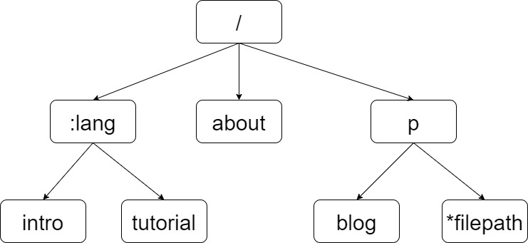

## 前缀树实现动态路由

所谓动态路由即由一条路由规则可以匹配某一类而非某一条固定的路由。本次实现的动态路由支持两种模式，分别为`:name`和`*filepath`，其中`/hello/:name`可以匹配`/hello/zeke`，`/hello/*filepath`可以匹配`/hello/css/icon.jpg`等，另外注意的是此次实现的动态路由仅支持匹配路由中第一个出现的`*` (即若)

### Trie树的构造

实现动态路由最重要的数据结构是前缀树 (Trie树)，前缀树每一个结点的子节点具有相同的前缀。



为此独立出一个trie.go文件实现trie树，对于trie树的每一个结点，如果该结点是一个合法的地址（即提供服务的地址如`/go/intro`），则在路由注册形成trie树时，该结点的`pattern`值非空，否则结点的`pattern`值为空。

```go
type node struct {
	pattern  string // 待匹配路由，例如 /p/:lang
	part     string // 路由中的一部分，例如 :lang
	children []*node // 子节点，例如 [doc, tutorial, intro]
	isWild   bool // 是否精确匹配，part 含有 : 或 * 时为true
}
```

例如，对于上图注册的前缀树，`/go/intro`可以匹配到前缀树的intro结点，并且调用`/:lang/intro`绑定的handle函数提供服务。

### Router的构造

router.go中维护两个map分别称为roots和handlers，其中roots的作用是给定方法（“GET”，“POST”等）寻找对应的已经注册了的前缀树的根结点，即不同的方法对应不同的前缀树，同一个方法不管注册多少条路由都只维护一个前缀树。

```go
type router struct {
	roots    map[string]*node
    // roots key eg, roots['GET'] roots['POST']
	handlers map[string]HandlerFunc
    // handlers key eg, handlers['GET-/p/:lang/doc'], handlers['POST-/p/book']
}
```

### Context的构造

Context中增加一个Params域，用于保存模糊匹配时对应的具体参数，例如在上述`/go/intro`模糊匹配`/:lang/intro`的例子中，`c.Params["lang"]="go"`

```go
type Context struct {
	// origin objects
	Writer http.ResponseWriter
	Req    *http.Request
	// request info
	Path   string
	Method string
	Params map[string]string
	// response info
	StatusCode int
}
```

